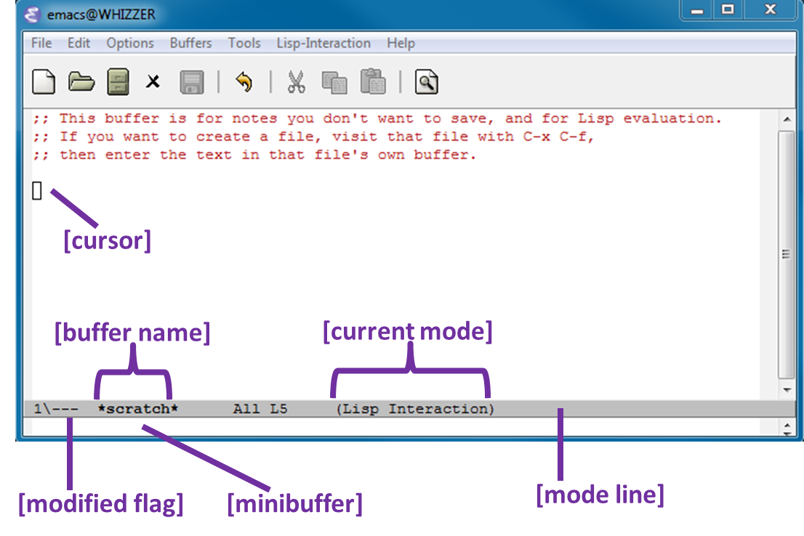

# 安装软件

Part A 使用 `Standard ML` 语言，采用 Standard ML of New Jersey compiler (SML/NJ) + Emacs 组合工具。

## 安装 Emacs

从 [这里](https://emacsformacosx.com/) 下载 Emacs Mac 版安装，需要 24.x 以上版本。

## Emacs 快捷键

* 光标是矩形块，称之为点。
* `buffer`：逻辑概念，比如当打开一个文件时，该文件被装载到 `buffer` 中；但 `buffer` 并非一定和文件相关。
* `mode`：每个 `buffer` 都在特定模式下编辑，不同语言有不同模式，最基础的是 `Fundamental` 模式。

Emacs 快捷键经常使用 `Control` `Meta` 键，分别用 `C-x` `M-x` 标记（注意，现在电脑很少有 `Meta` 键，在 windows 上用 `Alt` 代替，在 mac 上用 `Option` 代替）。当命令输入错误时，使用 `C-g` 或 `Esc` 取消当前命令。

基本命令：

* `C-x C-c` 退出 Emacs
* `C-g` 取消当前动作
* `C-x C-f` 打开文件
* `C-x C-s` 保存文件
* `C-x C-w` 写文件（另存为）

获取帮助：

* `C-h`
* `C-h b` 获取当前模式下的快捷键绑定

## 安装 SML/NJ

在 [这里](http://smlnj.cs.uchicago.edu/dist/working/110.81/index.html) 下载安装包，使用 `.𝚙𝚔𝚐` 版本，不要用 `.dmg`，安装路径选择默认。

编辑 `~/.bash_profile` 文件，添加 `export PATH=$PATH:/usr/local/smlnj/bin`，并导入配置 `source .bash_profile`。

在终端输入 `𝚜𝚖𝚕` 验证是否安装成功，使用 `Ctrl D` 退出 `sml`。

## 安装 Emacs SML 扩展

在 Emacs 中输入 `M-x list-packages` 查看是否有 `sml-mode` 插件，如果没有输入 `C-x k` 关闭当前 `buffer`，按下面步骤手动安装：

* 在 [这里](http://elpa.gnu.org/packages/sml-mode.html) 下载 `sml-mode-6.7.el` 文件。
* 在 Emacs 中输入 `sml-mode-6.7.el` 回车后输入 `sml-mode-6.7.el` 文件所在目录，回车后即可进行安装。
* 重启 Emacs。

再次进入 Emacs，用 `C-x C-f` 新建一个 `.sml` 文件，若模式从 `Fundamental` 变成 `SML`，输入 `C-c C-s` 回车，会打开一个 `sml` 命令行窗口，此时输入 `use "test.sml";` 会导入 `test.sml` 文件到当前 `sml` 命令行窗口中。
